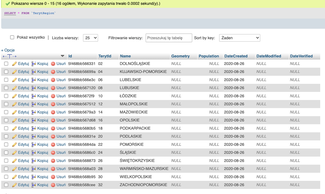
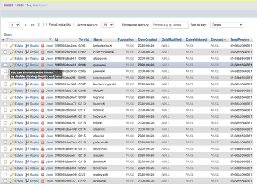

# :earth_africa: Poland Teryt API communication :house: :office: :hotel:
Main goal of this little project was to get current list of all Poland Cities.

This code is used to get API Teryt (https://api.stat.gov.pl/Home/TerytApi) data like Poland:
- Regions       (count = 16 - state mid 2020)
- Districts     (count = 380)
- Municipals    (count = 3798)
- Cities        (count = 80 k ?)

and store it into local database.





This code use class from https://github.com/gakowalski/teryt-webservices to connect to Teryt API
Thanks to @https://github.com/gakowalski :+1:
<br>
One more class was written to manage local database connection and store data from Teryt.

## :green_book: Use
Copy files, create database and run test.php 

# :zap: Installation

## 1.Database configuration :floppy_disk:
Create 5 tables in your database: 
- TerytRegion 
- TerytDistrict
- TerytMunicipal
- TerytCity
~~- TerytMunicipalType~~
~~- TerytCityType~~

To create use sql file create_tables.sql
In phpMyAdmin go to sql section and paste or use import function
*this will create new database name teryt

## 2.Set database connection in php :unlock:
Go to test.php file and set database connection credentials
```php
    private $servername = "localhost";
    private $username = "dbuser1";
    private $password = "1234";
    private $myDB   = "teryt"; 
```

## 3.Set Teryt API key or set to public key :key:
```php
    private $terytName = 'xxx';
    private $terytPassword = '4ssssssn';
```
*OR uncomment this line 
```php
    $this->webservice = new TERYT_Webservices('TestPubliczny', '1234abcd', 'test', true);
```
*and comment/disable this
```php
    //$this->webservice = new TERYT_Webservices($this->$terytName, $teryt->$terytPassword, 'production', true);
```

## Ready to go :+1:
Just run main php file. Simple as that :smiley:

*assume that You are on local system and have localdatabase mysql
*run script in Your browser=> localhost/GusTeryt/test.php

## Thanks To :pray:
- :watermelon: Jakub Ujwary 
- :green_apple: @https://github.com/gakowalski

## Limitations of use
You are free to use it. Enjoy
In code is sleep(1) function to prevent API request quota overlap, if You gain Your own API key you can experiment with disabling this limits

GUS Teryt Api has limitations:
Not registered users have lower request limits per minute (30?) per hour???, per day???
Registered users also have limits - per minute (60?)??? 

### How to get City X,Y? or population
Work in progress ...but You can use

- GUIK API to get coordinates of cities and then You must convert this coordinates using l4proj library.

- How to get Geometry of Regions, Districts, Municipals: https://capap.gugik.gov.pl/cat/org/gugik/dane/jednostki-administracyjne-f5cnk Download one file containing multiple geojson entries identified by TerytId

- How get Population ? You can use Another Teryt API BDL => https://api.stat.gov.pl/Home/BdlApi


## Minimal working example
Comment this lines in test.php

```php
    $this->checkMunicipalTypes();
    $this->checkCityTypes();
```

```php
    //$this->checkCity($m['TerytId'],$m['Id']);
```
